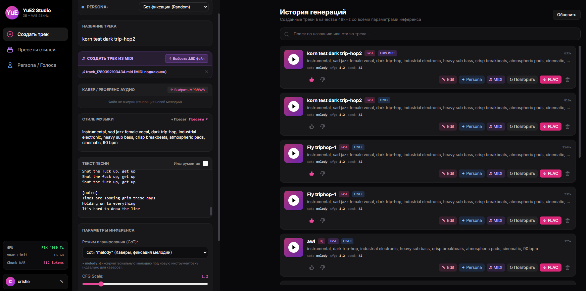

# YuE2-3B Studio (Local Web UI)

Локальная веб-студия для генерации, редактирования и ремикширования музыки с помощью нейросетевой модели **YuE2-3B** и вокодера **YuE2-VAE (48 kHz)**.

Интерфейс оптимизирован для работы на потребительских видеокартах с **16 GB VRAM** (протестировано на NVIDIA GeForce RTX 4060 Ti 16GB под Windows 10/11).


---

## Ключевые возможности

* **Генерация треков в Hi-Fi качестве**: Стереозвук 48 kHz в формате `.flac` с полным контролем структуры (`[verse]`, `[chorus]`, `[bridge]`, `[outro]`).
* **Режим инструментала**: Быстрое создание инструментальной музыки и саундтреков без генерации вокальных фонем.
* **Каверы и ремиксы (Audio Reference)**: Загрузка исходного аудио (MP3/WAV) для фиксации вокально-мелодической линии с полной заменой аранжировки и жанра.
* **Генерация по MIDI**: Импорт файлов `.mid` / `.midi` с автоматическим парсингом нот и темпа в нотную нотацию ABC для строгого следования мелодии.
* **Символический редактор партитуры (Edit Score)**: Встроенный редактор нотной записи `score.abc` прямо в веб-интерфейсе для изменения нот, аккордов и гармонии без артефактов частотной фильтрации.
* **Экспорт в MIDI**: Конвертация нотной партитуры сгенерированного трека в `.mid` в один клик для последующего импорта в DAW (FL Studio, Ableton, Reaper).
* **Поддержка вокальной и инструментальной Lora**: Поддержка вокальной и инструментальной Lora, файлы подключаются из каталога loras
* **Система Voice Persona**: Фиксация тембра, стиля и вокального сида для создания повторяемого голоса исполнителя в разных песнях.
* **Библиотека пресетов**: Быстрое сохранение удачных промптов стилей и их выбор из выпадающего списка.
* **Полноценный аудиоплеер**: Воспроизведение треков прямо в интерфейсе с поддержкой перемотки (HTTP 206 Range Streaming), оценка (Like/Dislike), поиск по истории и удаление треков с полной очисткой диска.

---

## Архитектура и оптимизации для 16 GB VRAM

В оригинальном репозитории генерация композиций длиной более 2 минут на картах с 16 GB VRAM вызывает ошибку `CUDA out of memory` (аллокация матрицы внимания 3.88 GiB на этапе диффузии). В проекте применены следующие решения:

1. **Чанкирование внимания в NAR (`query_chunk_size = 512`)**:
   Функция вычисления внимания Scaled Dot-Product Attention в `yue2.nar` разбивает обработку длинной последовательности токенов на блоки по 512. Пиковое потребление памяти на фазе синтеза снижено с **3.88 GiB до ~350 MiB** без деградации звука.
2. **Предотвращение фрагментации памяти**:
   Параметр `PYTORCH_CUDA_ALLOC_CONF="max_split_size_mb:128"` запрещает аллокатору PyTorch дробить память при частой смене тензоров между AR и NAR фазами.
3. **Межфазная очистка кэша**:
   Перед запуском диффузионного процесса принудительно вызываются `gc.collect()` и `torch.cuda.empty_cache()`, освобождая KV-кэш языковой модели.
4. **Режим FAST (ускорение в 3–4 раза)**:
   * Сокращение шагов диффузии Flow Matching с 32 до 16 шагов.
   * Ограничение длины авторегрессии до 3200 токенов (хронометраж ~1.5–2 мин), что исключает зацикливания и снижает общее время генерации с 14 до 3–4 минут.

---

## Структура проекта

```text
E:\YuE_Project\
├── models_cache\                  # Кэш весов моделей Hugging Face
├── outputs\
│   ├── web_tracks\                # Сгенерированные треки (.flac)
│   └── artifacts\                 # Нотные партитуры (score.abc) и MIDI (score.mid)
├── uploads\                       # Загруженные пользователем аудио и MIDI файлы
├── python.zip                     # Портативный архив Python 3.11 (с pip, без тяжелых библиотек)
├── python\                        # Распакованное окружение Python (создается через install.bat)
├── yue2_infer-0.1.5-py3-none-any.whl # Локальный пакет инференса модели YuE2
├── requirements.txt               # Зафиксированный список всех зависимостей
├── install.bat                    # Скрипт автоматической распаковки и установки в 1 клик
├── web_server.py                  # Серверная часть с очередью задач
├── index.html                     # Пользовательский веб-интерфейс
├── history.json                   # Метаданные истории генераций
├── presets.json                   # База пресетов стилей
├── personas.json                  # База сохраненных Voice Personas
├── profile.json                   # Настройки профиля пользователя
└── start_server.bat               # Скрипт запуска веб-студии
```

## Установка и запуск
1. Системные требования
ОС: Windows 10/11 (64-bit)

GPU: NVIDIA с объемом видеопамяти от 16 GB (RTX 4060 Ti, RTX 4080, RTX 3090, RTX 4090)

CUDA: 12.1 или новее

2. Подготовка и установка зависимостей
Убедитесь, что в корне репозитория лежат файлы python.zip, yue2_infer-0.1.5-py3-none-any.whl и requirements.txt.

Запустите скрипт автоматической установки:
```
DOS
install.bat
```
Скрипт автоматически распакует чистый Python из архива и установит все зависимости, включая PyTorch с CUDA 12.1, music21, звуковые кодеки и локальный пакет yue2-infer.

3. Настройка токена Hugging Face (Обязательно)
Веса моделей загружаются с платформы Hugging Face.

Получите бесплатный Read-токен в вашем аккаунте: Hugging Face Settings -> Access Tokens.

Откройте файл start_server.bat в любом текстовом редакторе (Блокнот).

Найдите строку set HF_TOKEN=... и укажите ваш токен:

```
set HF_TOKEN=hf_ВАШ_РЕАЛЬНЫЙ_ТОКЕН_ЗДЕСЬ
```
Сохраните изменения.

4. Запуск веб-студии
Запустите командный файл:

```
DOS
start_server.bat
```
После запуска сервер инициализирует среду и автоматически откроет страницу студии в браузере по адресу:

[http://127.0.0.1:7860](http://127.0.0.1:7860)
При первом запуске сервер автоматически загрузит веса модели m-a-p/YuE2-3B и вокодера YuE2-Vae в локальную папку models_cache\.

## Руководство по использованию
### Создание нового трека
В поле Название трека задайте имя композиции.

В поле Стиль музыки укажите жанр, инструменты, характер вокала и темп (например: industrial metal, dark trip-hop, female vocal, 135 bpm) или выберите готовый вариант через кнопку Пресеты.

В поле Текст песни добавьте текст с разметкой частей: [verse], [chorus], [bridge], [outro].

Для создания трека без вокала включите тумблер Инструментал.

Нажмите Создать трек. Прогресс отобразится в реальном времени.

#### Создание кавера (Audio Reference)
В блоке Кавер / Референс аудио нажмите Выбрать MP3/WAV и загрузите исходный трек.

Режим планирования CoT автоматически переключится на cot="melody".

Укажите новый желаемый стиль аранжировки в поле стиля.

Нажмите Создать трек. Модель зафиксирует мелодику вокала и исполнит трек в новом жанре.

#### Генерация по MIDI
В блоке Создать трек из MIDI загрузите файл .mid / .midi.

Сервер автоматически сконвертирует нотную партитуру в формат ABC.

Задайте стиль и запустите генерацию. Звук будет синтезирован строго по нотам из MIDI-файла, а трек получит отметку FROM MIDI.

Редактирование партитуры (Edit)
Найдите трек в блоке История генераций.

Нажмите кнопку Edit на карточке трека.

В открывшемся модальном окне отредактируйте ноты, аккорды или темп в текстовом поле score.abc, при необходимости скорректируйте стиль и сид.

Нажмите Сгенерировать по партитуре.

#### Экспорт в MIDI
Нажмите кнопку MIDI на карточке трека в истории. Файл будет скомпилирован на лету и сохранен с именем track_<id>.mid, готовый к переносу в Piano Roll любой DAW.

Создание и использование Persona
Нажмите кнопку Persona на карточке любого трека с удачным вокалом.

Задайте имя персонажа — система зафиксирует тембральный сид, стиль и вокальные теги.

В шапке панели создания трека выберите сохраненную персону: генерация применит характерный тембр к новым стилям и текстам.

#### Лицензия и благодарности
Модель: YuE2-3B (m-a-p/YuE2-3B)
Вокодер: YuE2-Vae (48 kHz stereo)
Конвертер нотации: music21